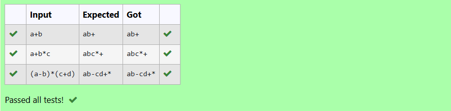

# Ex5 Stack Operations
## DATE:
## AIM:
To write a C function to perform push and pop operation of the stack in the infix to postfix conversion.

## Algorithm
1. Initialize an empty character stack and a `top` variable as -1.
2. To push an element, check if the stack is not full, then increment `top` and insert the element.
3. To pop an element, check if the stack is not empty.
4. If not empty, return the top element and decrement `top`.
5. If empty during pop, return -1 to indicate underflow.  

## Program:
```
/*
Program to find and display the priority of the operator in the given Postfix expression
Developed by: D VERGIN JENIFER
RegisterNumber: 212223240174
#include<stdio.h>

char stack[100];
int top = -1;

void push(char x)
{
   if (top!=100-1){
       stack[++top]=x;
   }
}

char pop()
{
   if (top!=-1){
       return stack[top--];
   }
   return -1;
}
*/
```

## Output:



## Result:
Thus the C program to perform push and pop operation of the stack in the infix to postfix conversion is implemented successfully.
